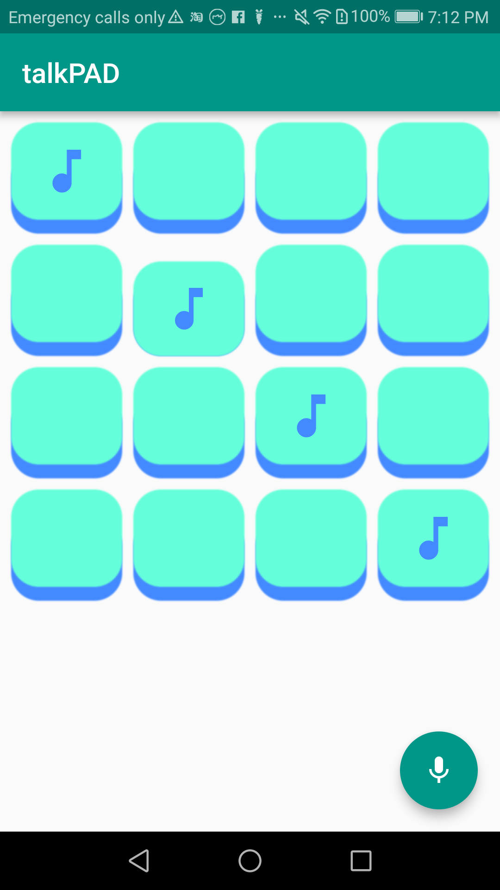
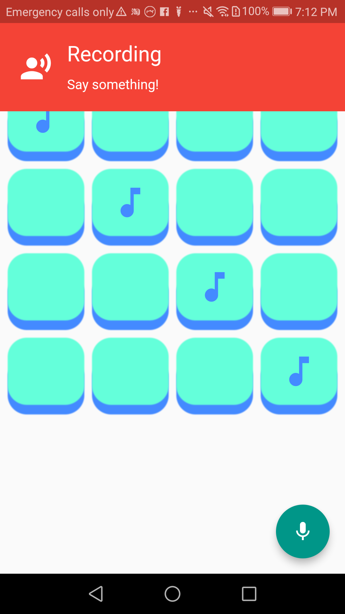

# talkPAD

An experimental launchpad-like app built in Flutter that allows users to play music by pressing buttons. The user may also record a speech that can be converted to midi notes.

## Getting Started

Currently the application only runs on Android due to minor differences with ios and android in the packages used.

To run on android, attach android device and run:
`
  flutter run --release
`

Make sure packages are installed and microphone usage is enabled on device for speech recognition.

Press any and hold any of the pre-loaded tunes to play thier sound(playing them in a certain order may yeild a familiar tune). Press the mic button to record a speech, once recording is finished a sample of the tune will be played back and press any key to save the tune to.

## How it works

Using speech recognition, a sentence gets transcribed. Then each word is converted to a number by summing up its letters with a => 1, b => 2... z => 26, then the word is mapped to a sound from 0 - 34 (low -> high), every other set of 34 numbers is made into a longer note.

Example:
`
  Flutter => 6 + 12 + 21 + 20 + 20 + 5 + 18 = 102 / 34 
  => 3 rem 0, meaning it will be the lowest note (rem 0) and held longer (odd offset)
`

## TODO

- Add IOS support
- Add functionality to go backwords from tune to words
- Implement an alternative simpler solution to finding notes with words

##

Spanish classical guitar sound samples by roberto@zenvoid.org is licensed under [CC0 1.0](http://creativecommons.org/publicdomain/zero/1.0/)
